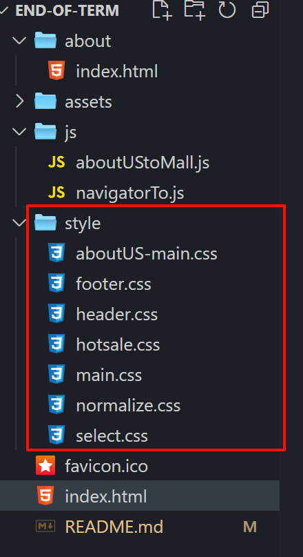
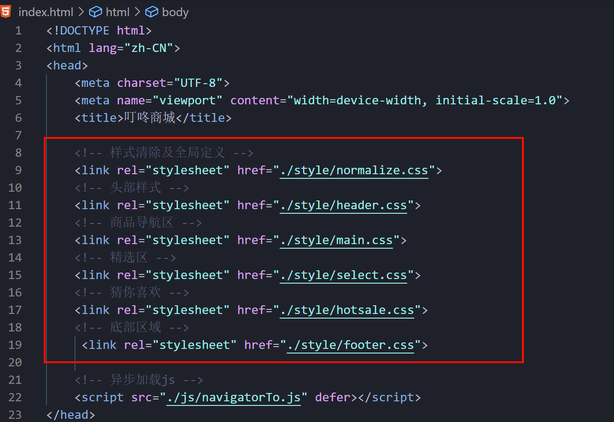
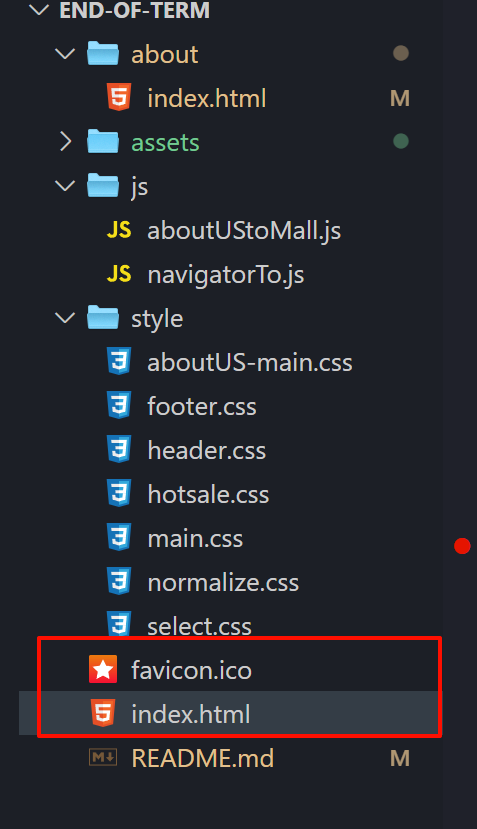

# git-end-of-term-mall-page 架构

#### 介绍
1. 独立开发的，基于`html5`  `css3`原生代码实现的商城页面，包括制作静态资源展示及样式设置
2. `css`样式采用**分区存储，增加代码复用性**，逐级代码嵌套，大量使用`flex`布局，伪元素选择器
	
	
3. 异步加载`js`样式
	```html
	<!-- 异步加载js -->
	<script src="../js/aboutUStoMall.js" defer></script>
	```

4. 使用根目录下唯一`.html`和`favicon.ico`配对方式实现网页图标
	

#### 软件架构
**结构与样式分离**
`./assets`中存放静态资源
样式代码分区存放到`./style`文件夹下
`js`代码在全局目录的`./js`


#### 使用说明

1. open with live server

2. 在`./style/normalize.css`文件中清除标签的默认内外边距，部分标签的默认样式，如`li` `input`

3. 主页主要分为五区，包含页面头部，导航栏，精选区，商品瀑布流展示区及页面脚部区

4. 头部区域清除`input`默认点击样式，右侧搜索使用`form`表单并链接到百度网址，可根据输入内容做查询

5. 导航栏区域

	1. 导航栏百亿补贴胶囊按钮中文字使用伪元素 `::after`实现文字及内边距设置

	2.  右侧区域字体使用`calc(20.5/2px)`计算属性调整到低于`12px`数值

		1. 每行元素的左内边距使用相邻兄弟选择器`span + span` : 实现除第一个span元素外同级其他span元素左边距为12px
			```css
			.fir-col {
			    padding-top: 22px;
			    justify-content: space-evenly;
			    /* 浏览器默认最小字体12px 这里使用calc做处理 */
			    font-size: calc(20.5px / 2);
			
			    /* 兄弟元素选择器，向下选择一层 这里选中第二三个span元素 */
			    > span + span {
			        padding-left: 12px;
			    }
			}
			```

6. `margin: 0 auto`实现居中效果

#### 参与贡献

1.  Fork 本仓库
2.  新建 Feat_xxx 分支
3.  提交代码
4.  新建 Pull Request
